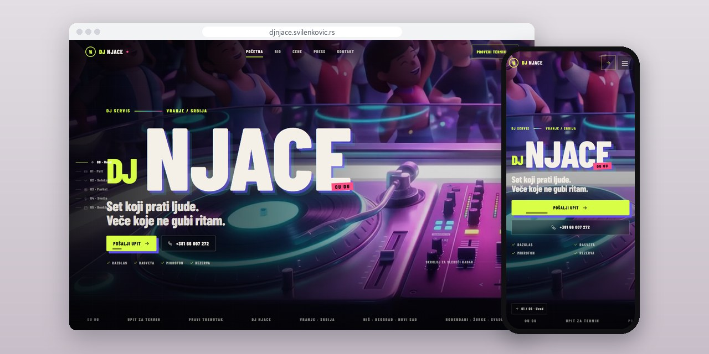
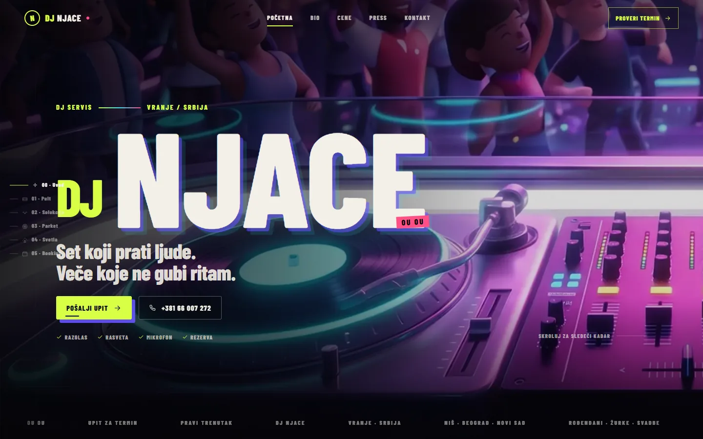
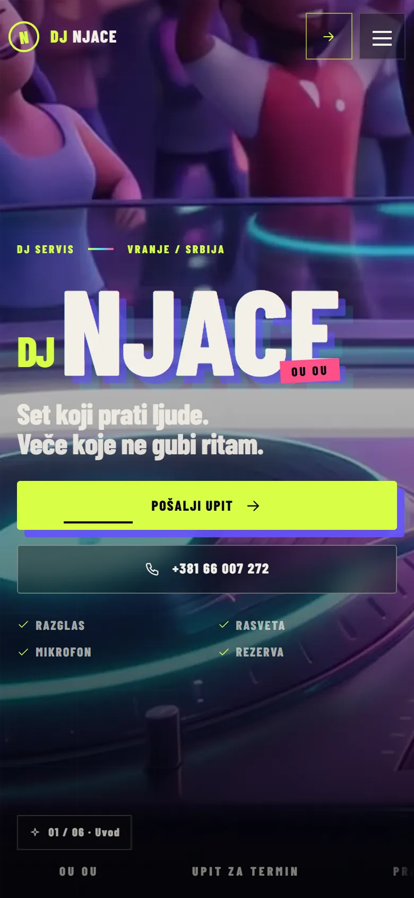
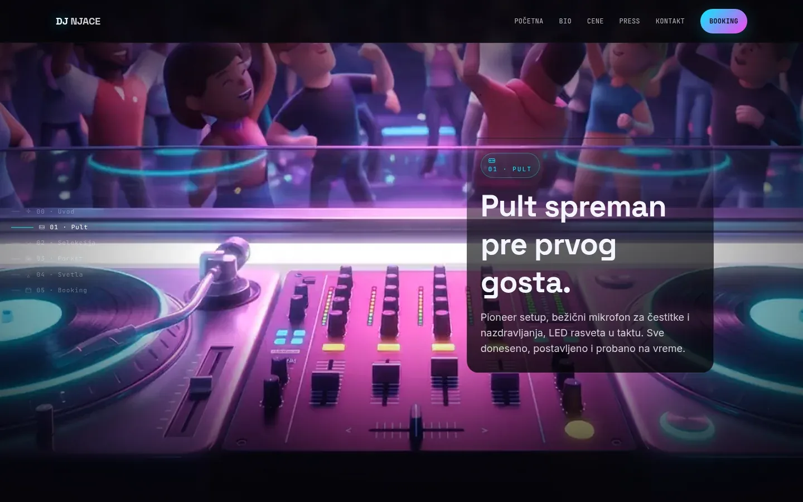
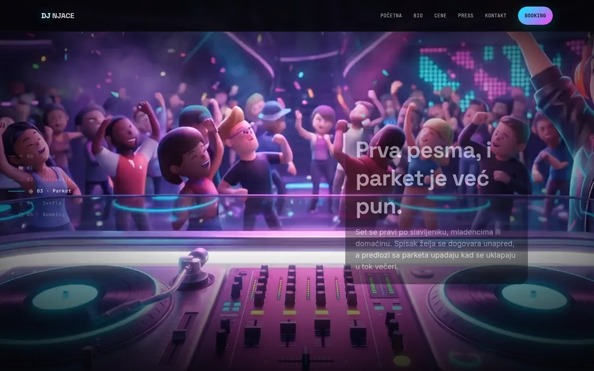

# DJ Njace

Demo sajt za DJ-a: naslovna se kreće kroz film dok se skroluje, uz cene po tipu proslave i formu za upit.

**[djnjace.svilenkovic.rs](https://djnjace.svilenkovic.rs/)** · [Studija slučaja](https://svilenkovic.rs/radovi/dj-njace) · [English](README.md)

> [!NOTE]
> Moj sopstveni demo. Izvorni kod je privatan. Ova stranica opisuje ideju i kako je napravljen.

<table>
  <tr><td><b>Klijent</b></td><td>Sopstveni demo</td></tr>
  <tr><td><b>Delatnost</b></td><td>DJ za rođendane, slave, svadbe i maturske večeri</td></tr>
  <tr><td><b>Lokacija</b></td><td>Vranje</td></tr>
  <tr><td><b>Vrsta</b></td><td>Sajt sa filmom na skrol i formom za upit</td></tr>
  <tr><td><b>Moj deo posla</b></td><td>Koncept, dizajn, izrada, SEO i hosting</td></tr>
  <tr><td><b>Tehnologije</b></td><td>Next.js 16, React 19, Tailwind, nginx, ffmpeg</td></tr>
</table>

## O projektu

DJ Njace je demo koji sam napravio da pokažem ceo sajt za izvođača, od prvog kadra do poslatog upita. U priči je DJ iz Vranja koji svira rođendane, slave, svadbe, maturske i firmske proslave. Sajt je složen oko onoga što ljudi prvo pitaju DJ-a: da li je datum slobodan, koliko košta i da li oprema dolazi uz nastup.

Prva verzija je imala pravu 3D scenu u pregledaču i izbacio sam je: zastajala je kad god bi se pojavio nov objekat, na uspravnom telefonu je pokazivala samo uzak pojas scene i tražila dodatni kod da sve to prikrije. Sada je pozadina film koji se pomera skrolom. Na desktopu je to video od 192 kadra u kome je svaki kadar ključni, pa premotavanje ne čeka dekodiranje. Telefoni ne umeju tako precizno da premotavaju video, pa dobijaju 84 WebP slike iscrtane na platnu, a uz smanjenje pokreta ili uštedu podataka ide nepomična slika.

## Šta sam uradio

- Naslovna visoka oko 9.000 px, u šest traka, sa naslovima traka u pravom HTML-u preko filma
- Cenovnik po tipu proslave, sa spiskom šta je uključeno, a Offer podaci i prikazana cena dolaze iz istog zapisa
- Petnaestak strana po tipu proslave, gradu i žanru, ukupno 23 adrese u mapi sajta
- Forma za upit sa proverom na serveru, skrivenim poljem za automate i ograničenjem slanja po IP adresi
- HTML bez keširanja i novo ime fajla za svaku verziju filma, uvedeni kad je stari paket iz keša na telefonu i dalje sam puštao video
- Vodilica po Catmull-Rom krivoj koja se iscrtava skrolom, pisana ručno, bez biblioteke za animaciju

## Merenja

| | Performanse | Pristupačnost | Dobre prakse | SEO |
| :-- | :-: | :-: | :-: | :-: |
| Telefon | 99 | 100 | 100 | 100 |
| Desktop | 100 | 100 | 100 | 100 |

PageSpeed Insights, laboratorijsko merenje živog sajta, septembar 2026. Sigurnosna zaglavlja: 6 od 6. HTML validator: bez grešaka. axe provera pristupačnosti: bez prekršaja. Strukturisani podaci: `EntertainmentBusiness`, `FAQPage`, `LocalBusiness`, `MusicGroup`, `Person`.

## Snimci ekrana

<table>
  <tr>
    <td width="68%" valign="top"></td>
    <td width="32%" valign="top"></td>
  </tr>
</table>

Traka "Pult spreman pre prvog gosta": kadar se pomerio, a tekst je pravi HTML

Traka "Prva pesma, i parket je već pun": o spisku želja dogovorenom unapred

---

Izrada: [D. Svilenković](https://svilenkovic.rs).
